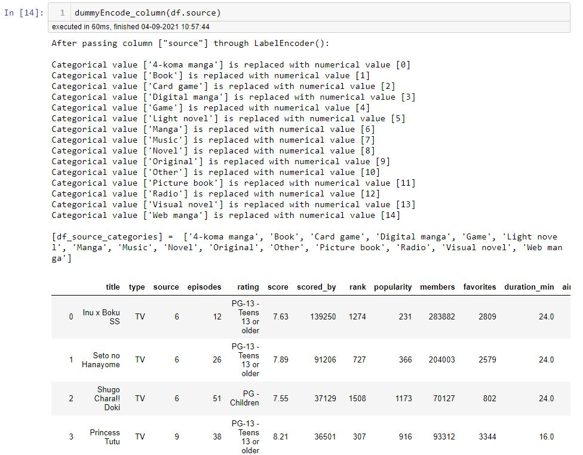
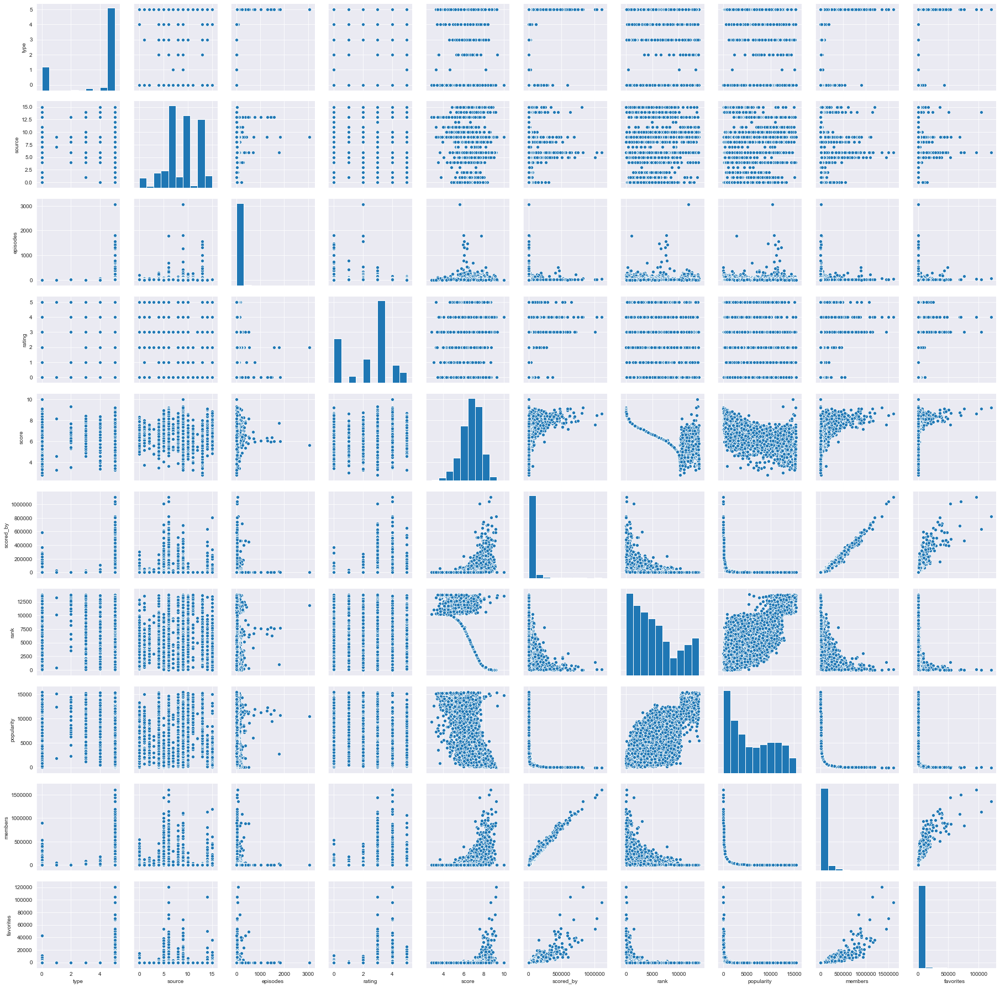
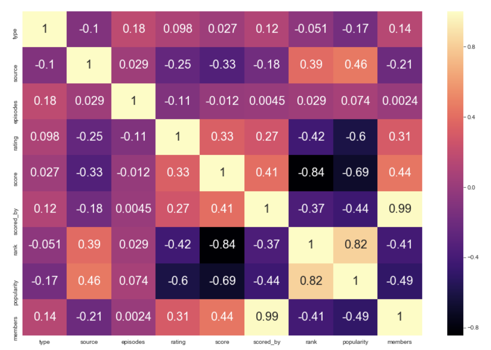
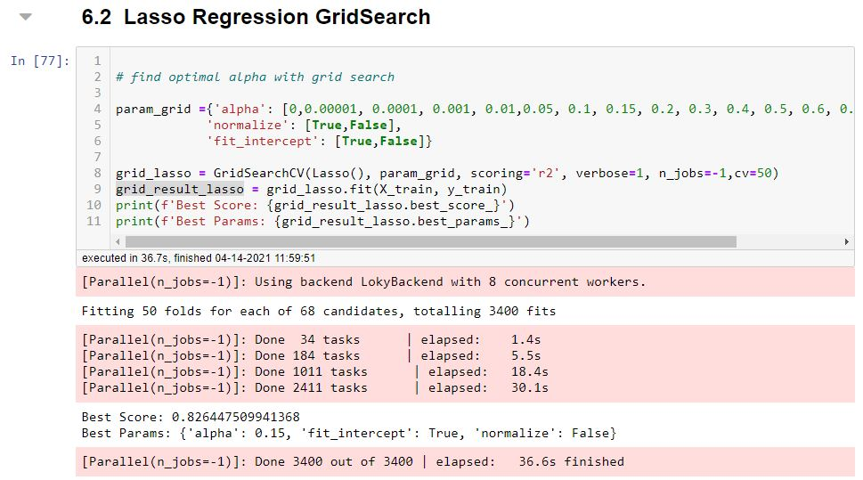
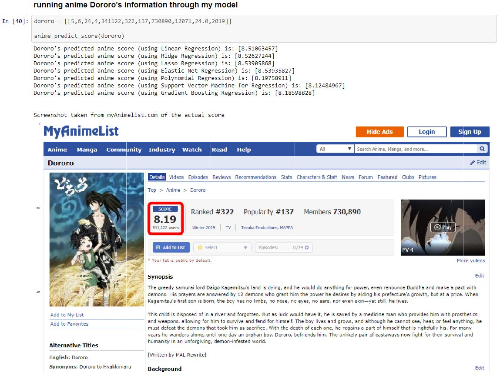

# Flatiron Project-3 --- Anime Score Predictor

Project3-Anime Database

For my third project in Flatiron I wanted to use a dataset I really was interested in. I chose to do my project on anime. Specifically  data on anime from myAnimelist.net. I used a .csv file from kaggle.com the had data from myAnimeList.net. I had to drop more then half of the dataset because it was mainly hentai and I'm not interested in that for this project. Maybe later... but seriously from 14,478 to 5,561 unique anime data points and a few entries that were not usable.

## What Did I Do?

* Imported .cvs file

* Cleaned .csv file and removed all hentai.

* Created Dummies variables, using LabelEncoder wrapped in a custom function, for non-numerical data (for columns : Type, Source, Rating) so we can work with these categorical data.

* Visualized all data against each other to see if we can find any solid correlations

* Found correlations between each category.

* I then made a few models (Simple and Multiple Linear, Ridge, Lasso and Polynomial Regressions) to predict the scores.

- My best preforming model has an accuracy of ~82.64% (Lasso)

* Predicting Score of an Anime (Not in dataset) - Manually inputted Anime info

Anime with release date 2019 (last release year supported in the dataset)

Anime with release date pass 2019 (release year not supported in the dataset)

## Built With

* Python3.8
* Jupyter Notebook 6.0.0
* A few imports: pandas, numpy, matplotlib.pyplot, seaborn, statsmodels and sklearn

## Authors

* **Samuel Diaz** - *Creator* - [sdman135](https://github.com/sdman135/)

## License

This project is licensed under the MIT License - see the [LICENSE.md](LICENSE.md) file for details

## Acknowledgments

* Azathoth - https://www.kaggle.com/azathoth42/myanimelist (the initial .csv file I used, had to clean heavily though...)
* codebacis - https://www.youtube.com/channel/UCh9nVJoWXmFb7sLApWGcLPQ
